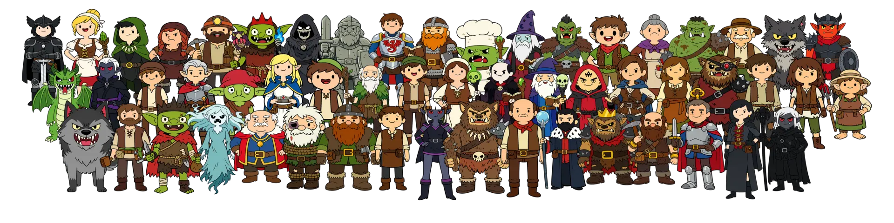

# Lost Mine of Phandelver NPCs

This module brings all the characters from the Lost Mine of Phandelver adventure to life in Foundry VTT! It includes a compendium of NPC actors summarized and illustrated with a fun cartoon style token, ready to add personality to your storytelling scenes and combat encounters.

## Content & Compatibility

The module includes custom actor tokens and summarized descriptions, not monster statistics. It will find the correct creature statblocks to use for the Lost Mine of Phandelver characters from your available Foundry VTT compendium sources.

## Credits & Legal

The AI-generated avatars are inspired by the Adventure Time series' art style. This module is not affiliated with or endorsed by Adventure Time or its creators.

> _Lost Mine of Phandelver NPCs_ is unofficial Fan Content permitted under the Fan Content Policy. Not approved/endorsed by Wizards. Portions of the materials used are property of Wizards of the Coast. ©Wizards of the Coast LLC.
